# **Lab Paper Presentation**: Learning the signatures of the human grasp using a scalable tactile glove  

**Presenter:** Tran Ngoc Duy - M1          **Presentation day:** 23/03/2026  **Duration:** 60 minutes
## **Paper Information**  
**Author:** Subramanian Sundaram, Petr Kellnhofer, Yunzhu Li, Jun-Yan & Wojciech Matusik
**Affiliation:** MIT (Massachusetts Institute of Technology)  
**Journal:** Nature  
**Year:** 2019  
https://doi.org/10.1038/s41586-019-1234-z 

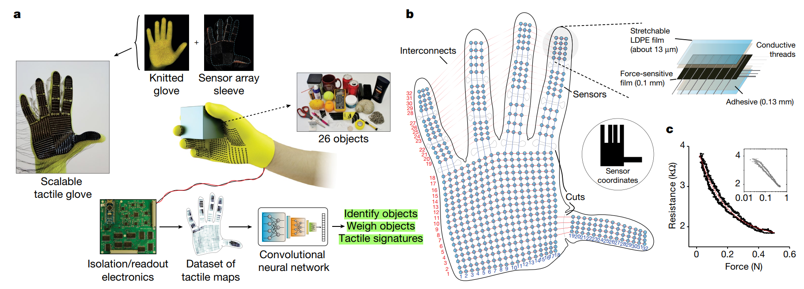  

   The STAG: a low-cost, scalable tactile glove and a platform to learn from the human grasp.

## **Introduction**

**Background**:
Humans possess a remarkable ability to rely on tactile sensing alone, even without visual input, to recognize objects, estimate their weight, and infer effective grasping strategies. In contrast, tactile sensing in robotics remains limited by several major challenges. 

- **Lack of large-area tactile sensors**: Tekscan Grip system, with 349 sensors, is one of the closest high-cost commercially available systems, yet it still does not fully cover the hand
- **Absence of large-scale real-world tactile datasets** impeded our fundamental understanding of the human grasp.
- **Insufficient learning models that can effectively interpret tactile signals.**  

**Objective of the Paper**:
- Designing a Scalable Tactile Glove (STAG) covering the entire hand
- Collecting a large tactile dataset  
- Applying deep learning (CNN) to:
  - Objects Identification
  - Object Weight Prediction
  - The role of hand pose and the interaction between different regions of the hand

<!-- ## **Demo and Outstanding Feature**

  Demostration of Scalable Tactile Glove (STAG) in contact with mug (on the left) and safety glasses (on the right).

 -->

<!-- ## Explanation the Concept
- ResNet-18 
- ImageNet25 dataset 
- force-sensitive film
- low-density polyethylene (LDPE) film
- Tekscan Grip system
- auxetic prototype
- ResNet-18-based architecture24 that takes N input frames
- Rectified Linear Units (ReLU)
- N distinct clusters  -->
## **System Design: STAG Tactile Glove**
<!-- 

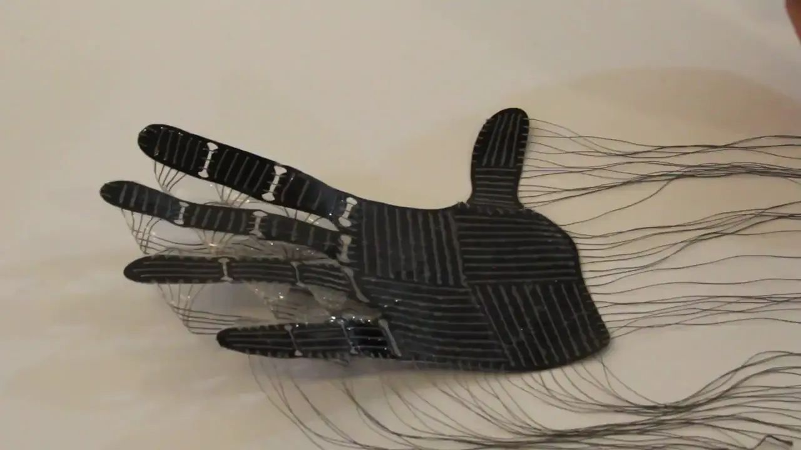  

 -->

 

**Tactile Glove Features:**  
- The STAG can record tactile videos (with frame rate approximately 7.3 Hz)
- Normal forces in the range 30 mN to 0.5 N (in practical application, fingertip can generate 0.01 N to 10 N)
- Peak hysteresis of about 17.5%
- Low-cost materials (around US$10) over long intervals
- STAG can be translated to a variety of different designs  

**Result:**
- Large-scale dataset of tactile maps (135,000 frames) recorded using the STAG while manipulating objects with a single hand. 
- CNN trained only on tactile input can identify objects with improving accuracy as more tactile frames are provided
- Their CNN predicts the weights of previously unseen objects better than a simple linear baseline, achieving an average error of about 56.88 g compared with 89.68 g for the linear model
- Spatial coordination patterns of the human hand during grasping: strong correlations between fingertips and the thumb base, as well as cooperative patterns among distal finger regions.
- Using large recorded tactile data alone, the model classified different grasp/posture types with about 89.4% accuracy

## **Tactile Sensor Characteristics and Manufacturing**
The glove consists of 548 tactile sensors and the 64 electrodes (64 wires) attached on top of a custom knit glove (it only have 548 sensors due to the area in hand shape, so some sensors are cut off). This sensor array consists of a **force-sensitive film (FSF)** (0.1 mm thick) addressed by a network of **orthogonal conductive threads** (0.34 mm) on each side, insulated by **a thin both side adhesive** (0.13 mm) and a **low-density polyethylene (LDPE) film** (about 13 μm)

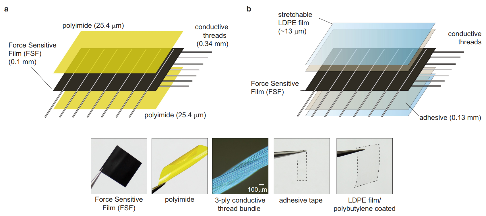
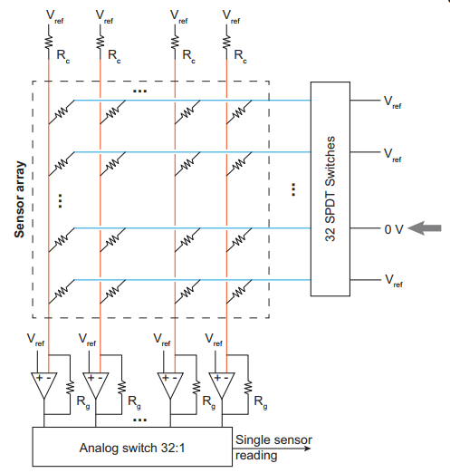

**Sensor laminate manufacturing process in detail:**
1. Sensing laminate attached to a light, custom-knit glove
2. FSF is cut by laser when placed in a acrylic board
3. 3-ply stainless steel conductive threads then are sewn with a needle on either side of the FSF
4. Two-sided acrylic adhesive tape   on both sides to fix the position of electrode
5. Finally, two exposed sides of the adhesive are insulated with a thin, stretchable polybutylene-coated LDPE film
6. Exposed conductive threads are coated with a polydimethylsiloxane mixture on hot plate to insulate to prevent short circuit and enhance the mechanical stress while operating
<!-- **Working Principle**
Each sensor is composed of:
- conductive threads (arranged as rows and columns),
- Force-Sensitive Film (FSF, Velostat) as the sensing layer
- LDPE film and adhesive layers for insulation and mechanical support. -->
  
**Working principle of FSF (Force Sensitive Film)**

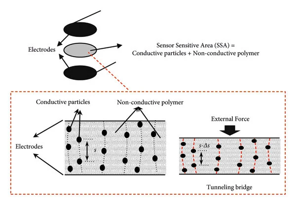
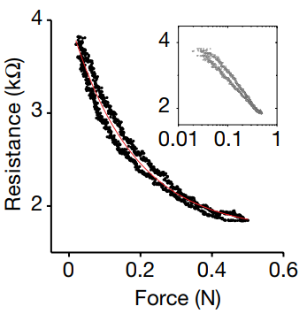

Force-sensitive film works by using the change in resistance of a specific polymer to detect the force applied to the film. Inside the polymer, there are conductive particles dispersed within a non-conductive polymer matrix. When force is applied to the surface of the film, which also acts as the electrodes, the distance between the conductive particles decreases. This reduces the resistance between the two electrodes. Based on this principle, the applied force can be measured by monitoring the resistance and a reference voltage.
> force on sensor → resistance change → amplifier output voltage → ADC value → tactile map

## **Experiments Method and Results**
<!-- General objective here is to learn from successful human interactions with objects, which are typical of daily interactions. Therefore, the STAG prototype was used to record single hand manipulation of 26 different common objects with a few different sizes, weights and materials
**Visually aware** allows us to record human interactions with a constant level of awareness of the object at each frame. Each object was manipulated for 3–5 min at a time and included several different grasps and touch sequences.One additional task was performed without any object as an empty hand control -->
<!-- **Blindfolded conditions**articulating the hand without interacting with any object. -->
### **Object Identification Task** 
 **Dataset Collection**: 
 **Method:** For object recognition, the authors use a modified **ResNet-18 CNN** (1 initial convolution layer + 16 convolution layers inside the residual blocks + 1 final fully connected layer) to identify 26 objects. Since the tactile input is only 32 × 32, they reduce the initial kernel size and stride so the network better matches the spatial scale of the tactile signal. They also use dropout and noise augmentation to reduce overfitting. 

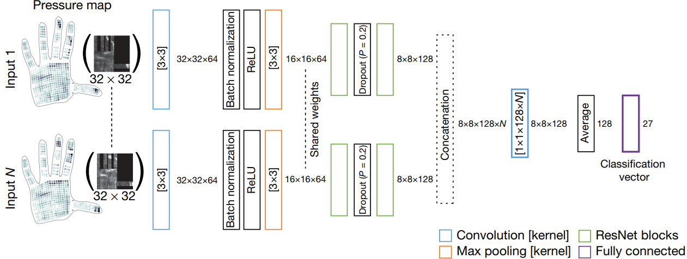
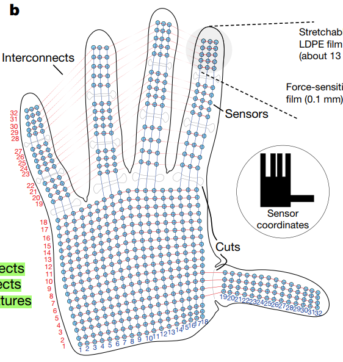

- **32 × 32 pressure map:** raw tactile image
- **3 × 3 convolution:** detect small local tactile patterns
- **Batch norm + ReLU:** stabilize and add nonlinearity
- **Max pooling:** reduce resolution, keep important responses
- **ResNet blocks:** learn more abstract tactile/grasp features
- **Dropout:** reduce overfitting
- **Shared branches:** process each frame the same way
- **Concatenation:** gather evidence from multiple frames
- **1 × 1 convolution:** fuse information across frames
- **Average pooling:** summarize the whole feature map (128 input feature like a evidence: for fingertip contact, thumb involvement, palm support...)
- **Fully connected layer:** output object class scores (27 class includes 26 object and 1 empty hand)

> An important design choice is that the model can take N tactile frames from a single interaction instead of just one. Each frame goes through the same CNN branch, and the features are combined before classification. The idea is that different grasps of the same object provide complementary tactile information.

 **Result**: The classification accuracy increases as the number of input frames N increases, reaching its best performance at about 7 input frames. This makes sense: multiple tactile contacts provide more information about the object than a single grasp snapshot. Figure 2b shows both Top-1 and Top-3 accuracy improving with N.
<!-- 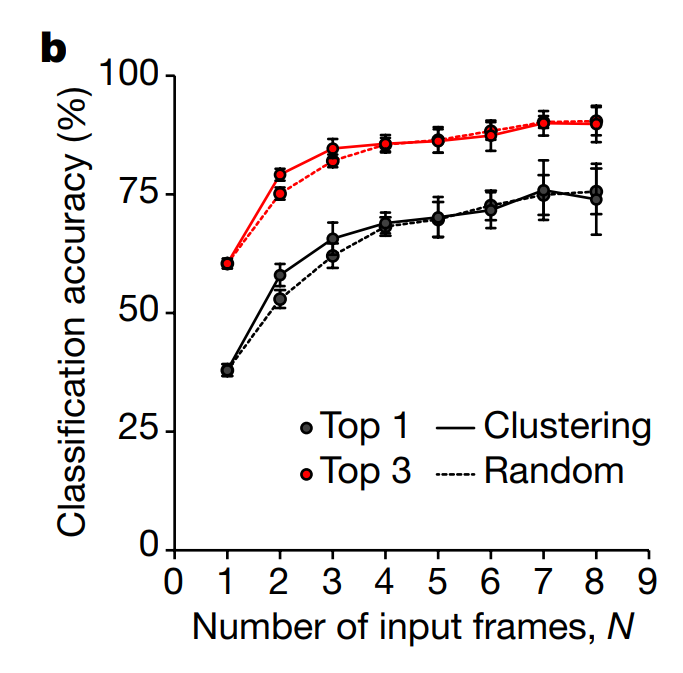 -->

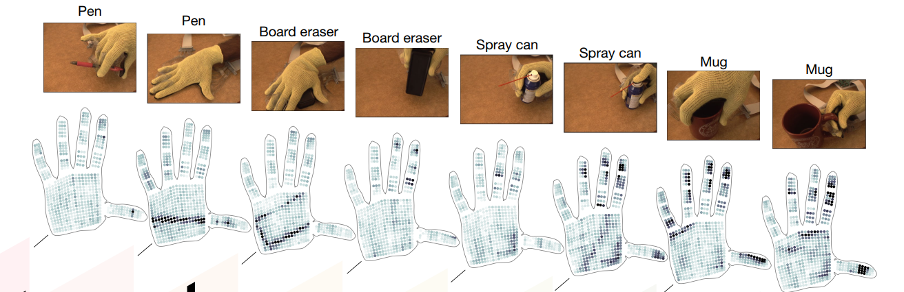

The confusion matrices show that: light or small objects such as the spoon, coin, and safety glasses are harder to classify, larger and heavier objects with more distinct tactile signatures, such as the tea box, are easier to identify, objects with similar size, shape, or weight are more likely to be confused.
The examples in Figure 2c also show that the same object can be easier or harder to identify depending on the grasp. For example: a mug is easier to recognize when grasped by the handle than from the side, a pen is easier to identify when it contacts the palm than when it is only between the fingers. This suggests that the tactile map contains not only local contact information, but also information about hand posture.
### **Weight Estimation Task** 
**Method:** For this task, the authors recorded a separate dataset where each object was grasped from above using a standardized multi-finger grasp, so the model could not simply associate a unique grasp with a specific object.

**Leave-one-out setup**: when predicting the weight of one object, that object is excluded from training. This forces the model to generalize to unseen objects.
Pipeline is roughly: 
> One tactile frame in **➜**  CNN extracts features **➜**  Fully connected layer outputs a single predicted weight.

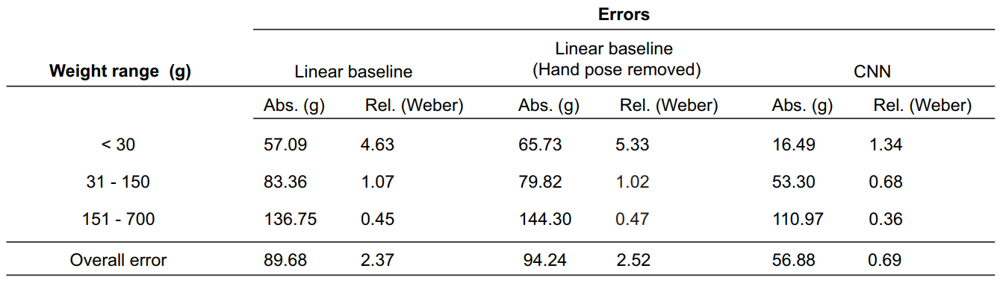

**Results:** The CNN achieves an average prediction error of about **56.88 g**, a simple linear baseline gives about **89.68 g** error. This result shows that weight estimation from tactile maps is possible, but the relationship is **nonlinear**. It **depends** not only on total force, but also on **hand articulation**, **friction**, and **anti-slip forces**. The CNN captures some of that structure better than a naive linear model.
### **Correlations across the hand**
**Analyzing the “signatures” of human grasp**: By subtracting the pre-contact frame from the post-contact frame to obtain decomposed object-related signal, separate:
- The hand pose signal: a frame just before contact, treated as hand pose only,
- The object-related pressure signal: frames after contact, treated as object interaction frames.

Using the decomposed object-related signal, the authors compute: Pearson correlations between individual sensors, canonical correlations between larger hand regions. 

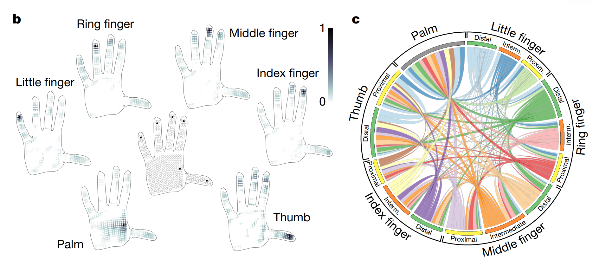

**Results** in Figure 3b and 3c show that:

- Fingertips are strongly correlated with the thumb base,This is consistent with the classic precision grip
- Distal phalanges of the major fingers often work together with the thumb to generate gripping force
- The palm becomes more involved in grasps where the object contacts a larger hand
<!-- ## Learning Model: Deep Learning Approach -->

<!-- 
- **Problem: Paper giải quyết vấn đề gì?**
  - giai quyet van de ve tactile system that could not thin and dense enough to record the real sense of human's hand grasping
- **Method: Họ làm bằng cách nào?**
  - develop a glove that have a lot of tactile sensor element
  - record a huge dataset in grasping a set of object to train a CNN model to identify object, and predict the weight of objects
- **Result: Kết quả ra sao?**
  - they find the relationship and corespondence of fingers
  - the  prediction is great in indentifying object
  - the weight prediction is better in comparation with the linear model
- **Contribution: Đóng góp mới là gì?**
  - scalarable dense tactile sensor glove  -->
**Hand Gesture Prediction**

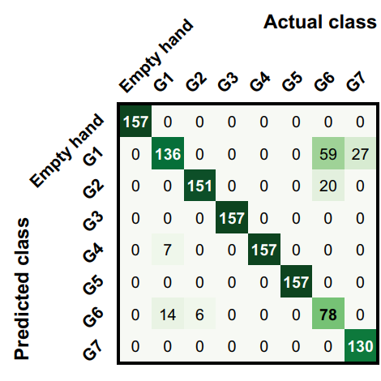
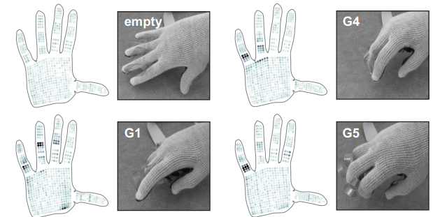

The authors tested whether the glove contains enough proprioceptive information to recognize different hand configurations. They selected seven grasp/hand poses from a grasp taxonomy, plus an empty-hand pose, and recorded tactile maps while the subject articulated those poses. After filtering, they trained the same CNN architecture on these tactile maps and found that the model could classify the poses with about **89.4% accuracy**.
<!-- ### Other Experiments
Hytersis experiment
Temperature experiment
Auxetic prototype
ResNet-18 trained on the ImageNet
over multiple cycles  -->
## **Possible Improvements and Personal Comment**

This work is very strong, but several aspects could still be improved. The system measures only normal force and does not capture shear forces, even though shear is often important in stable grasping and slip detection. In addition, the human hand can also sense other modalities such as temperature, which are not included in this tactile glove.

<!-- cos theer cho them video vao de co the show cho moi nguoơ xem
Polyimide giỏi ở “flex” kiểu uốn, nhưng không giỏi ở stretch/compliance đa hướng như kiến trúc dùng LDPE + adhesive mềm.
Cho nên nếu dán trên bề mặt phẳng hoặc array cố định thì polyimide ổn. Nhưng với glove full-hand, vật liệu mềm hơn sẽ hợp hơn.

“Dropout randomly disables a subset of neurons during training, forcing the network to learn more robust and independent features. This reduces overfitting and improves generalization.”

“Dropout randomly disables a subset of neurons during training, forcing the network to learn more robust and independent features. This reduces overfitting and improves generalization.”
“SPDT stands for Single Pole Double Throw. The 32 SPDT switches are used for multiplexing, allowing the system to select different sensor lines for sequential readout.”
“A 32-to-1 analog switch is a multiplexer that selects one of 32 analog input signals and routes it to a single output for measurement.”

ResNet-18 is a residual convolutional neural network with skip connections. These connections let the model learn residual features instead of full transformations, which improves gradient flow and enables stable training of deep networks.

“The Weber fraction measures relative error, which aligns with human perception, as humans are more sensitive to proportional changes rather than absolute differences in weight.”

“The authors show that most of the variance in tactile data is caused by hand pose rather than object properties. However, the CNN is still able to extract object-related information by learning features that are invariant to pose.”

“The linear model is used as a baseline to demonstrate that the task cannot be solved with simple linear relationships. By comparing against it, the authors show that capturing nonlinear spatial patterns is essential, which justifies the use of CNNs.”

“The goal is not to benchmark all models, but to show that linear assumptions are insufficient. Once that is established, CNN becomes a natural choice due to the spatial structure of tactile data.”

“Tactile data is inherently nonlinear because contact mechanics, friction, and hand-object interactions create complex, coupled pressure patterns that cannot be described by simple linear combinations of sensor readings.”

“While other architectures such as DenseNet, EfficientNet, or Vision Transformers could also be used, ResNet-18 provides a strong balance between performance, stability, and computational efficiency, making it a suitable choice for this tactile sensing task.” -->
